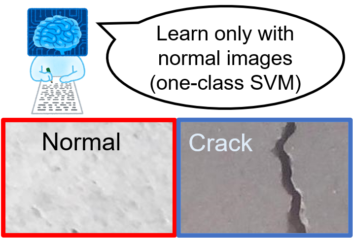
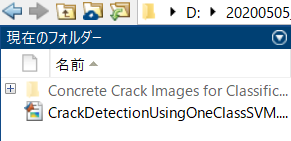
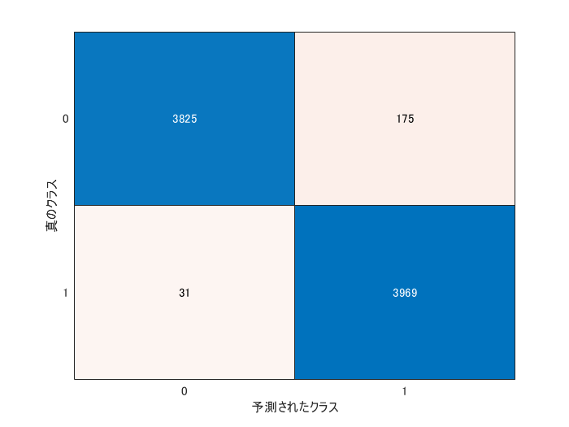
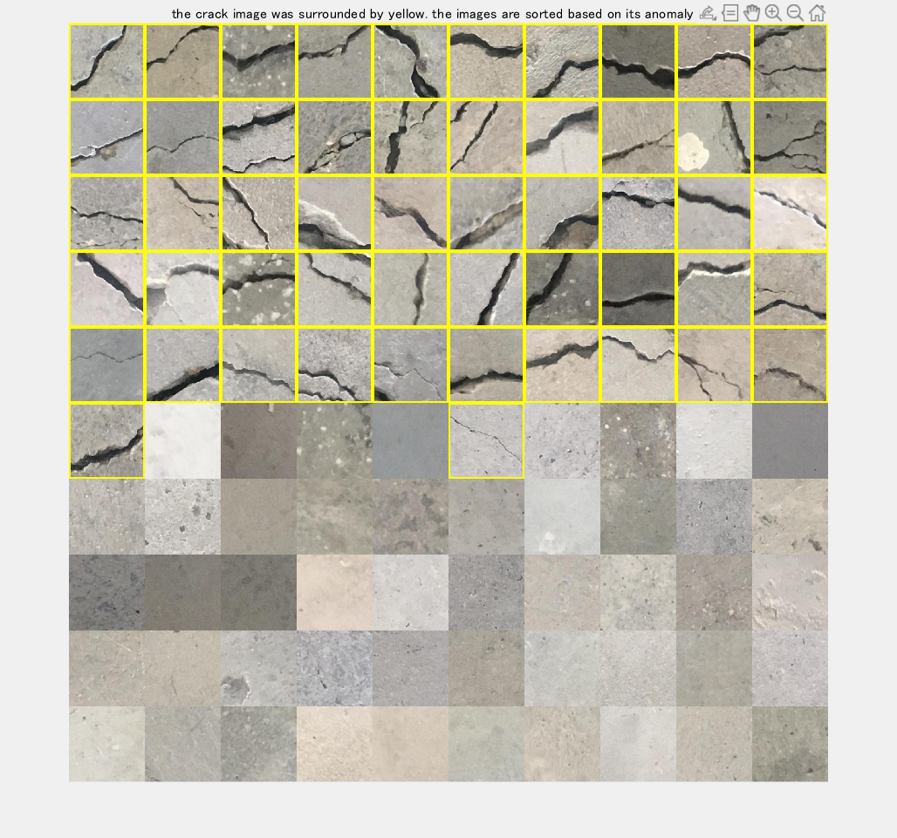

# Crack detection using one-class SVM

This demo shows how to detect the crack images using one-class SVM. In anomaly detection, normal images can be obtained a lot, while the anomaly images are not frequenctly obtained; we cannot get sufficient number of training image of the anomaly data. In that case, a classifier was trained only with normal images and the anomaly images are detected when the pattern is different from the one it has learnt. 



In this demo, we use a dataset of concrete crack images introduced by L Zhang [1]. The data is available at [2]. 

A portion of this code was obtained from Deep Learning Evaluatio Kit located [here](https://jp.mathworks.com/matlabcentral/fileexchange/70156) [3].

[1] Zhang, Lei, et al. "Road crack detection using deep convolutional neural network." *2016 IEEE international conference on image processing (ICIP)*. IEEE, 2016.

[2] Concrete Crack Images for Classification ([https://data.mendeley.com/datasets/5y9wdsg2zt/1](https://data.mendeley.com/datasets/5y9wdsg2zt/1))

[3] Takuji Fukumoto (2020). ディープラーニング評価キット [画像分類用] (https://www.mathworks.com/matlabcentral/fileexchange/70156), MATLAB Central File Exchange. Retrieved May 5, 2020.

  

First of all, please download "Concrete Crack Images for Classification" from [2]. Then unzip it to name as COncrete Crack Images for Classification. Please run this code after confirming that the file is in your current directory as shown below.  



```matlab:Code
clear;clc;close all
imds = imageDatastore('Concrete Crack Images for Classification', ...
    'IncludeSubfolders',true, 'LabelSource','foldernames');
% split all the images into training, validation and test data 
[imdsTrain,imdsValid,imdsTest]=splitEachLabel(imds,0.7,0.1);
% specify the image augmenter to implement image augmentation
augmenter = imageDataAugmenter('RandXReflection',false);
% load a pre-trained network ResNet18
net=resnet18;
% confirm the size which the pre-trained network accepts
sz=net.Layers(1, 1).InputSize;
% set the images into the augmentedImageDatastore to easily conduct data
% augmentation
augimdsTrain = augmentedImageDatastore([sz(1:2)],imdsTrain,'DataAugmentation',augmenter);
augimdsValid = augmentedImageDatastore([sz(1:2)],imdsValid,'DataAugmentation',augmenter);
augimdsTest = augmentedImageDatastore([sz(1:2)],imdsTest,'DataAugmentation',augmenter);
numAll=numel(imds.Files);
```

# Pick up the normal images to train

Please note that this demo assumes that we only have normal images and do not have anomaly (crack) images at all. Then, we train only with normal images and detect anomaly images with the test images including anomaly images

```matlab:Code
% collect only normal images (We assume we have only normal images)
imdsNormalIdx=find(imdsTrain.Labels=='Negative');
numImagesTrain=10000;
imdsTrainInput=readByIndex(augimdsTrain,randperm(numel(imdsNormalIdx),numImagesTrain));
```

# Extract features using the pre-trained network

```matlab:Code
% specify the name to which the convolutional operation is done
fLayer = 'pool5';
% use activation function to calculate the image feature
trainingFeatures = activations(net, cat(4,imdsTrainInput.input{:}), fLayer, ...
               'MiniBatchSize', 32, 'OutputAs', 'columns','ExecutionEnvironment',"auto");    
```

# Train one-class SVM classifier with `fitcsvm` function

```matlab:Code
% Prepare a dammy-label for one-class SVM
W = ones(size(trainingFeatures, 2), 1);
% Perform the one-class SVM using fitcsvm function
d = fitcsvm(trainingFeatures', W, 'KernelScale', 'auto', 'Standardize', false, 'OutlierFraction', 0.04,'KernelFunction','gaussian');
```

# Perform a validation with `imdsValid`

```matlab:Code
% feature extraction with the validation dataset
validFeatures = activations(net, augimdsValid, fLayer,'MiniBatchSize', 256, 'OutputAs', 'columns','ExecutionEnvironment',"auto");  
% get the label information of the validation data
validLabels = imdsValid.Labels;
% calculate the score for the anomaly detection. Lower value means higher
% anomaly level 
[~, scoreValid] = predict(d, validFeatures');
% the threshold for the classification is zero. if the score is higher than
% zero, it will be nomal image, otherwise, anomaly (crack)
YpredValid=scoreValid<0;
% calculate the overall accuracy
% use grp2idx function to create index vector from grouping variable
validAccuracy=mean((grp2idx(validLabels)-1)==YpredValid)
```

```text:Output
validAccuracy = 0.9623
```

# Conduct the final test

If the accuracy in the validation data is satiscactory, please do the final test with the test images. 

```matlab:Code
% please refer to the comment in the prior section
testFeatures = activations(net, augimdsTest, fLayer, ...
              'MiniBatchSize', 256, 'OutputAs', 'columns','ExecutionEnvironment',"auto");   
testLabels = imdsTest.Labels;
[~, scoreTest] = predict(d, testFeatures');
YpredTest=scoreTest<0;
% grp2idx(s) creates an index vector g from the grouping variable s. 
% The output g is a vector of integer values from 1 up to the number K of distinct groups. 
% This function enables to convert "negative" and "positive" into integer
% values for the evaluation
testAccuracy=mean((grp2idx(testLabels)-1)==YpredTest)
```

```text:Output
testAccuracy = 0.9743
```

The metrics like recall and precison are often computed for evaluating the anomaly detection. The confusionchart function reterns the confusion matrics. The precision and recall are calculated from the outcome. 

```matlab:Code
cm = confusionchart(grp2idx(testLabels)-1,double(YpredTest));
```



```matlab:Code
cmNormValue=cm.NormalizedValues;
precision=cmNormValue(2,2)/(cmNormValue(1,2)+cmNormValue(2,2))
```

```text:Output
precision = 0.9578
```

```matlab:Code
recall=cmNormValue(2,2)/(cmNormValue(2,1)+cmNormValue(2,2))
```

```text:Output
recall = 0.9923
```

The test images were correctly classified into normal and anomaly images with a high accuracy. 

# Display the result 

Total of 100 images were randomly taken from test images to display the result

In this section, 

1) Randomly 100 images were taken from the test data

2) The images were classified using the one-class SVM classifier

3) The classified images were sorted based on the anomaly score 

4) The classified images were displayed and the anomaly images were shown with yellow rectangle

```matlab:Code
% use randperm function to obtain 100 indices of test images
% each index corresponds to one image
dispIdx=randperm(numel(YpredTest),100);
% retrieve anomaly score using the index called dispIdx
dispScore=scoreTest(dispIdx');
% sort the anomaly score 
[score_sorted, idx] = sort(dispScore);
% get the test label
disptestLabel=testLabels(dispIdx(idx));
% read the images to show using the index
im = readByIndex(augimdsTest,dispIdx);
% convert the images into 4D-type
im = cat(4,im.input{:});
% sort the images based on the anomaly score
im = im(:,:,:,idx);
% prepare for display
dispIm=zeros(sz(1),sz(2),3,100,'uint8');
% loop over the batch
for i=1:100
    % if the image is "positive" one, the image is surrounded by yellow
    % rectangle
    if disptestLabel(i) ==categorical(cellstr('Positive'))
        % use insertShape function to add to a rectangle
        dispIm(:,:,:,i) = insertShape(uint8(im(:,:,:,i)),'rectangle',[1 1 sz(1) sz(2)],'LineWidth' ,10);
    else
    dispIm(:,:,:,i)=uint8(im(:,:,:,i));
    end
end
figure('visible','on');montage(dispIm, 'Size', [10 10]);title('the crack image was surrounded by yellow. the images are sorted based on its anomaly level')
```



You can find that the anomaly (crack) images tend to come first with higher anomaly score (lower score means higher possibility to be anomaly). While the classifier learns only the normal images, the crack image could be succesfully detected. This technique for anomaly detection with images will be effective in a wide variety of fields.
